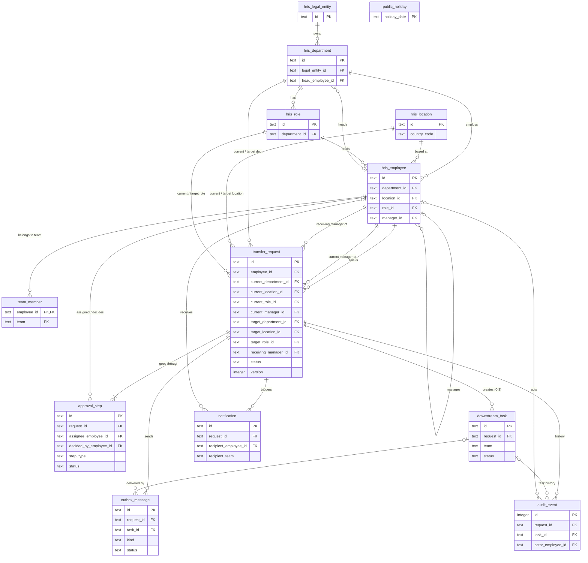

# Relationships & ERD — Internal Transfer

**Tables and columns:** [00-schema-design.md](00-schema-design.md)
**Status:** Draft v0.1 — 2026-10-06

## 1. ERD

Only keys are shown; full columns are in the schema design.

`public_holiday` has no relationships; it is read when counting working days (BR-11).

## 2. Relationship list

Cardinality is read as *parent : child*. No relationship cascades on delete — every FK is `RESTRICT` (default), because requests and their history are never deleted (BR-25).

### 2.1 Simulated HR system

| # | Parent | Child | FK column | Cardinality | Null FK? | Meaning / spec |
|---|---|---|---|---|---|---|
| R-01 | `hris_legal_entity` | `hris_department` | `legal_entity_id` | 1 : N | No | Department belongs to one legal entity (BR-18) |
| R-02 | `hris_department` | `hris_role` | `department_id` | 1 : N | No | Role belongs to one department (BR-05) |
| R-03 | `hris_department` | `hris_employee` | `department_id` | 1 : N | No | Employee's current department |
| R-04 | `hris_location` | `hris_employee` | `location_id` | 1 : N | No | Employee's current location; gives country (BR-18) |
| R-05 | `hris_role` | `hris_employee` | `role_id` | 1 : N | No | Employee's current role |
| R-06 | `hris_employee` | `hris_employee` | `manager_id` | 0..1 : N | Yes | Self-reference: current manager (BR-14) |
| R-07 | `hris_employee` | `hris_department` | `head_employee_id` | 0..1 : N | Yes | Department head = receiving manager (A-32) |

R-03 and R-07 form a cycle (employee ↔ department); see seeding order in the schema design §4.5.

### 2.2 Portal

| # | Parent | Child | FK column | Cardinality | Null FK? | Meaning / spec |
|---|---|---|---|---|---|---|
| R-08 | `hris_employee` | `team_member` | `employee_id` | 1 : N | No | Employee's team memberships (BR-21) |
| R-09 | `hris_employee` | `transfer_request` | `employee_id` | 1 : N, **max 1 active** | No | Requester; `ux_request_one_active` (BR-08) |
| R-10 | `hris_employee` | `transfer_request` | `current_manager_id` | 1 : N | No | Manager at submission |
| R-11 | `hris_employee` | `transfer_request` | `receiving_manager_id` | 1 : N | No | Head of target department (A-32, A-44) |
| R-12 | `hris_department` | `transfer_request` | `current_department_id`, `target_department_id` | 1 : N (each) | No | Two FKs to the same table |
| R-13 | `hris_location` | `transfer_request` | `current_location_id`, `target_location_id` | 1 : N (each) | No | Location change decides the Facilities task (BR-15) |
| R-14 | `hris_role` | `transfer_request` | `current_role_id`, `target_role_id` | 1 : N (each) | No | |
| R-15 | `transfer_request` | `approval_step` | `request_id` | 1 : 1..N, **max 1 `PENDING`** | No | One row per assignment; `ux_step_one_pending` (BR-03) |
| R-16 | `hris_employee` | `approval_step` | `assignee_employee_id` | 0..1 : N | Yes (null for HR step) | Named approver (FR-06) |
| R-17 | `hris_employee` | `approval_step` | `decided_by_employee_id` | 0..1 : N | Yes | Who approved/rejected |
| R-18 | `transfer_request` | `downstream_task` | `request_id` | 1 : 0..3, **max 1 per team** | No | Payroll, IT, Facilities; `ux_task_team` (BR-15) |
| R-19 | `transfer_request` | `outbox_message` | `request_id` | 1 : N | No | All external calls for the request |
| R-20 | `downstream_task` | `outbox_message` | `task_id` | 0..1 : N | Yes (null for HR record update) | Create / cancel / date-change calls for a task |
| R-21 | `transfer_request` | `notification` | `request_id` | 1 : N | No | FR-17 |
| R-22 | `hris_employee` | `notification` | `recipient_employee_id` | 0..1 : N | Yes (null when sent to a team) | |
| R-23 | `transfer_request` | `audit_event` | `request_id` | 1 : 1..N | No | Every request has at least the `SUBMIT` event (BR-25) |
| R-24 | `downstream_task` | `audit_event` | `task_id` | 0..1 : N | Yes | Task status history |
| R-25 | `hris_employee` | `audit_event` | `actor_employee_id` | 0..1 : N | Yes (null for system actors) | |

## 3. How the tables change through the journey

| Journey step (spec §5) | `transfer_request` | `approval_step` | `downstream_task` | `outbox_message` | `notification` | `audit_event` |
|---|---|---|---|---|---|---|
| J3 Submit | insert, `PENDING_CURRENT_MANAGER` | insert step 1 `PENDING` | — | — | employee, current manager | `SUBMIT` |
| J4 Current manager approves | → `PENDING_RECEIVING_MANAGER` (or `PENDING_HR` if same person) | step 1 `APPROVED`; insert step 2 `PENDING` (or `SKIPPED` + step 3) | — | — | employee, next approver | `APPROVE` (+ `SKIP`) |
| J5 Receiving manager approves | → `PENDING_HR` | step 2 `APPROVED`; insert step 3 `PENDING` (team HR) | — | — | employee, HR | `APPROVE` |
| J6 HR approves | → `IN_PROGRESS`; `hr_update_status` → `SCHEDULED` | step 3 `APPROVED` | insert 2 or 3 rows `NOT_SENT` | `TASK_CREATE` per task | employee, both managers | `APPROVE` |
| J7 Task delivered | — | — | → `OPEN` | → `DONE` | — | `TASK_STATUS` |
| J8 Team completes | — | — | → `DONE` | — | — | `TASK_STATUS` |
| J9 Effective date | `hr_update_status` → `SENDING` → `SUCCEEDED` | — | — | `HR_RECORD_UPDATE` | — | `HR_RECORD_UPDATE` |
| J10 Complete | → `COMPLETED` | — | — | — | employee, both managers | `COMPLETE` |
| Any rejection | → `REJECTED` | pending step `REJECTED` + comment | — | — | per FR-17 | `REJECT` |
| J12 Withdraw | → `WITHDRAWN` | pending step `CANCELLED` | — | — | approvers | `WITHDRAW` / `AUTO_WITHDRAW` |
| HR cancel | → `CANCELLED`; `hr_update_status` → `CANCELLED` | — | open tasks → `CANCELLED` | `TASK_CANCEL` per open task | employee, both managers | `CANCEL` |
| HR changes date | `effective_date` updated | — | — | `TASK_DATE_CHANGE` per open task | employee, both managers | `CHANGE_DATE` |
| Manager / head change | `receiving_manager_id` updated if head changed | pending step `REASSIGNED`; insert new `PENDING` | — | — | new approver | `REASSIGN` |

Every row in a step is written in **one transaction**, so a request never has a status without its matching step, task, outbox, notification and audit rows (NFR-03, NFR-06).
